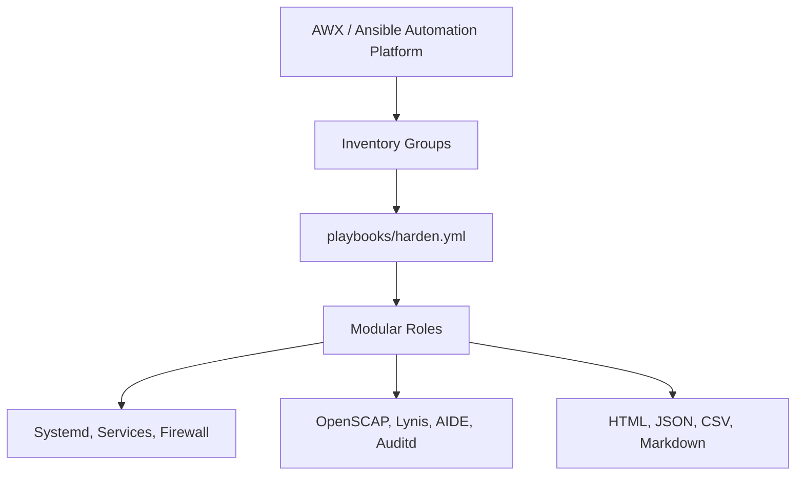

# Architecture Overview

```mermaid
flowchart TD
  AWX[AWX / Ansible Automation Platform] --> Inventory[Inventory Groups]
  Inventory --> Playbook[playbooks/harden.yml]
  Playbook --> Roles[Modular Roles]
  Roles --> Services[Systemd, Services, Firewall]
  Roles --> Compliance[OpenSCAP, Lynis, AIDE, Auditd]
  Roles --> Reporting[HTML, JSON, CSV, Markdown]
```
